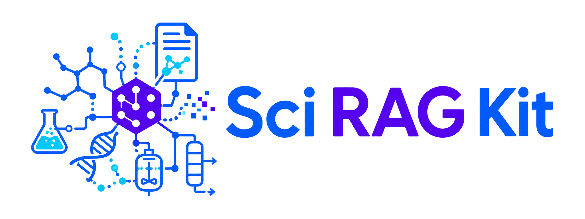
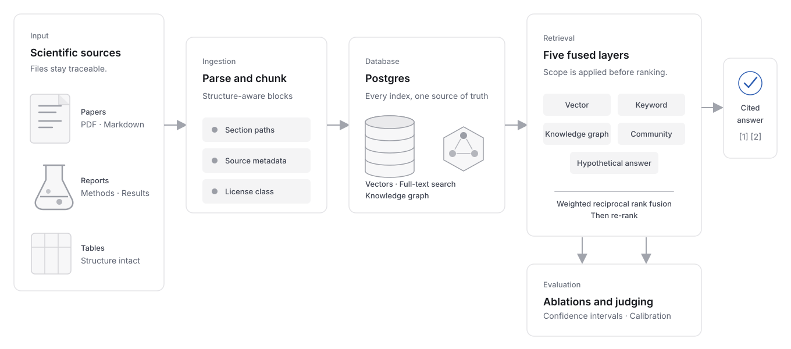

<section class="srag-home-section srag-home-masthead" markdown>

  
  

# Retrieval-augmented generation, built around your scientific domain.

Sci RAG Kit provides a blueprint for scientific RAG development, from document
ingestion, to knowledge graph generation, retrieval and evaluation. Fully
extensible and ready to serve over API and MCP.

</section>

<section class="srag-home-section" markdown>

<figure class="srag-home-figure">
  
  <figcaption>End-to-end RAG architecture that ships with Sci RAG Kit.</figcaption>
</figure>

</section>

<section class="srag-home-section" id="demo" markdown>
</section>

<section class="srag-home-section" id="components" markdown>

## What's in the kit?

Document ingestion: PDF, HTML, Markdown, and text files become passages
that keep their section headings and their tables intact, so a number
retrieved from "Table 3" still knows which experiment it belongs to.
[Follow a document into storage](architecture.md#data-model).

Five kinds of search: by meaning, by exact words, through a graph of the
field's concepts, through summaries of related concepts, and through a
model-written hypothetical answer. The model-dependent layers require a
credential. Their result lists merge into a single ranking that says which
layer found what. [See how a question is answered](learn.md#what-happens-to-a-question).

One database: passages, vectors, the full-text index, and the concept graph
all live in Postgres. That leaves one thing to run, one thing to back up,
and one place where a chunk and its graph entries commit together.
[Read why](adr/0001-graph-in-postgres.md).

Rights built in: every document carries a license class, and a request that
restricts rights never sees passages outside it, because the filter runs
inside each search before anything is ranked. [Read the rights
rules](methodology.md#7-scope-precedes-ranking).

Cited answers: with LLM provider credentials, every claim points at a numbered
passage. When the documents do not contain an answer, the kit says so rather
than filling the gap from a model's memory. [Use REST or MCP](api.md).

Measurement: a file of questions with known answers lets the kit score
retrieval, grade generated answers, and report what each search layer
contributes on the corpus at hand, so a change is judged by numbers rather
than by impression. [Evaluate your pipeline](evaluation.md).

</section>

<section class="srag-home-section" id="repository" markdown>

## Configure around your domain

Point the kit at a new domain by editing plain-text configuration. The domain's
concepts, prompt wording, and scoring questions all load at run time without
Python changes.
`domain/` holds everything specific to the domain: the concepts the graph
looks for, the prompt wording, and the test questions. `data/` holds the
documents themselves and a one-line-per-document manifest that records who
wrote each one and whether its text may be redistributed. Everything else
is the pipeline, and most projects never open it.

<pre class="srag-home-tree" aria-label="Annotated repository tree"><code>your-sci-rag/
├── domain/           the field: concepts, prompts, test questions
├── data/             the documents and their manifest
├── src/sci_rag/      the pipeline, from ingestion to serving
├── migrations/       database tables
├── tests/            runs offline
├── infra/terraform/  optional Google Cloud deployment
└── docs/             this site</code></pre>

[Project structure](get-started.md#project-structure) · [Bring your own domain](bring-your-own-domain.md)

</section>

<section class="srag-home-section" id="start" markdown>

## Where to start

[QuickstartCreate a project, ingest the demo corpus, ask a question, and serve the result. About ten minutes.](quickstart.md){ .srag-row }

[Bring your own domainSeven commands from a folder of documents to a knowledge base that answers questions about them.](bring-your-own-domain.md){ .srag-row }

[How it worksWhat happens between a document and a cited answer.](learn.md){ .srag-row }

[Evaluate your pipelineMeasure retrieval and answers against questions with known answers, and see what each search layer contributes.](evaluation.md){ .srag-row }

[Run a corpus campaignFind papers by topic or DOI list, check their rights, and download the open-access PDFs.](campaigns.md){ .srag-row }

[FAQShort answers to what this is, who it is for, and why it is built this way.](faq.md){ .srag-row }

[Choosing Sci RAG KitHow the kit compares with LightRAG, PaperQA2, LlamaIndex, and Microsoft GraphRAG.](choosing-sci-rag-kit.md){ .srag-row }

</section>
